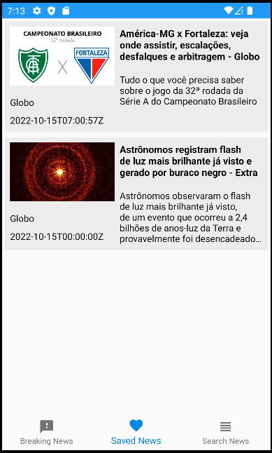

<h1 align="center">News App</h1>

  

<h3 align="center">
  :heavy_check_mark: Status: Finished Project :rocket:
</h3>

 <a href="#about">About</a> •
 <a href="#purpose">Purpose</a> •
 <a href="#features">Features</a> •
 <a href="#layout">Layout</a> • 
 <a href="#how-it-works">How it works</a> • 
 <a href="#tech-stack">Tech Stack</a> • 
 <a href="#author">Author</a> • 
 <a href="#user-content-license">License</a>

## :computer: About 

## :dart: Purporse 

## :gear: Features

## :art: Layout

<h3 align="center">Breaking News</h3>
<h4 align="center">
  
</h4>

<h3 align="center">Article</h3>
<h4 align="center">
  
</h4>

<h3 align="center">Saved News</h3>
<h4 align="center">
  
</h4>

<h3 align="center">Search News</h3>
<h4 align="center">
  
</h4>

## 🛠 Tech Stack

The following tools were used in the construction of the project:
